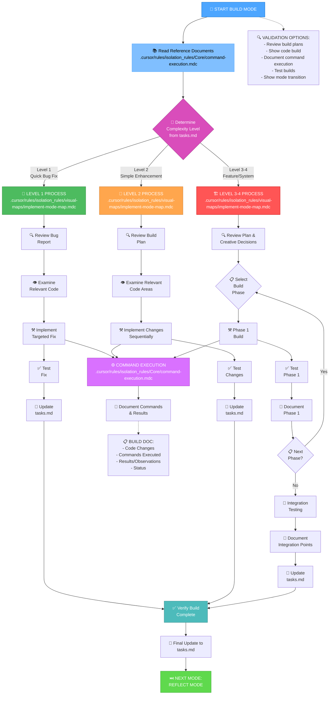
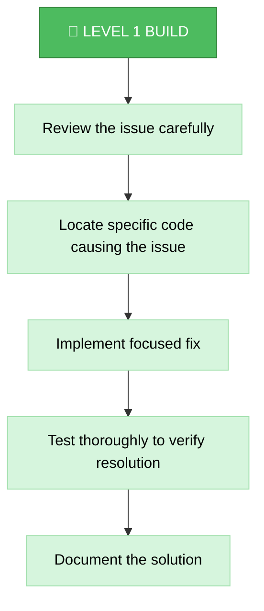
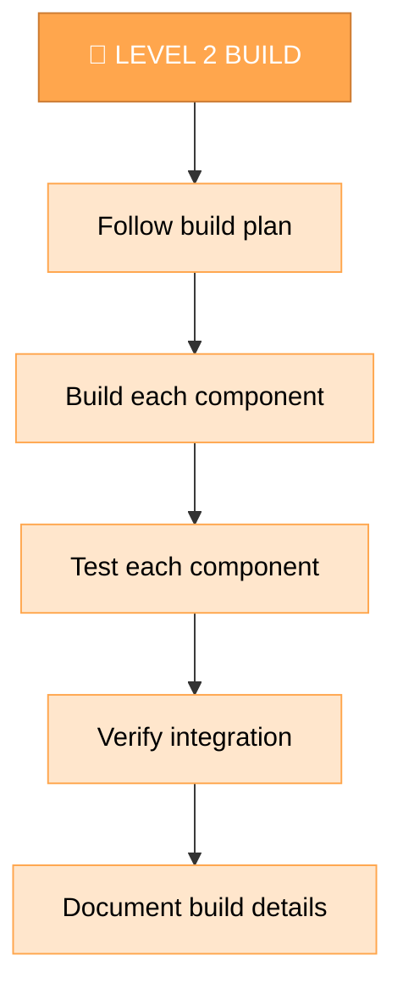
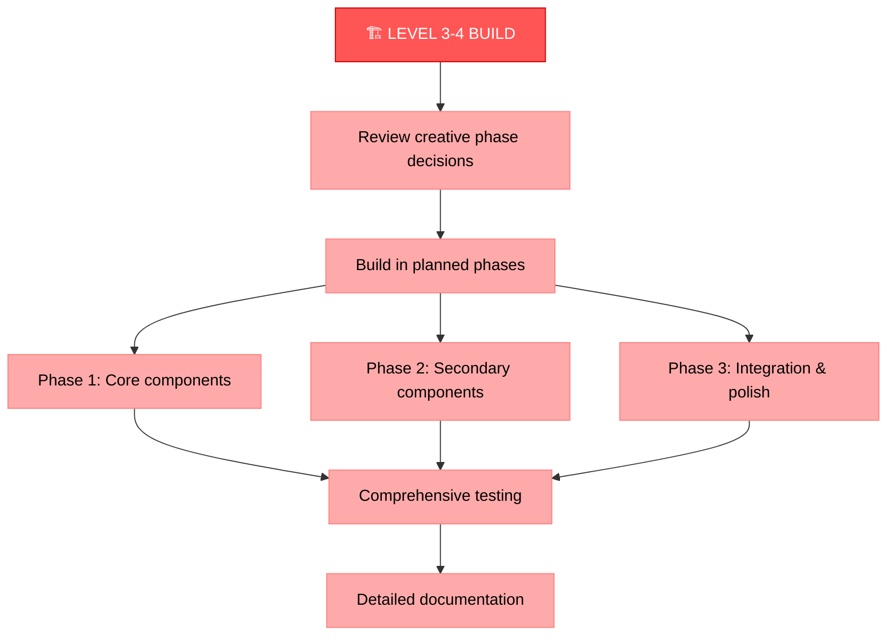
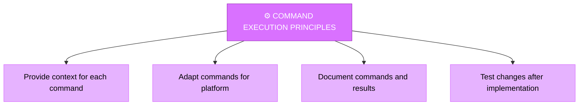
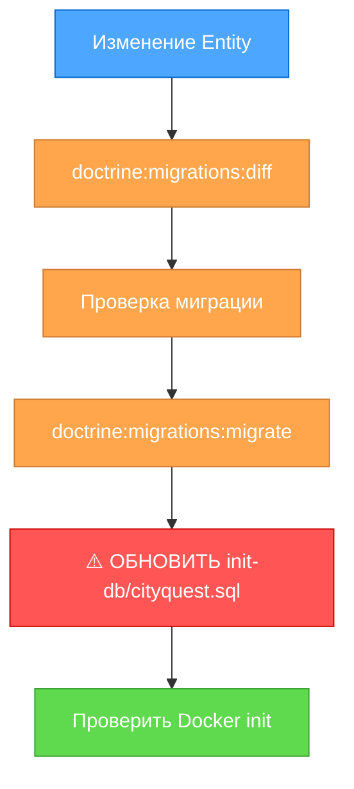
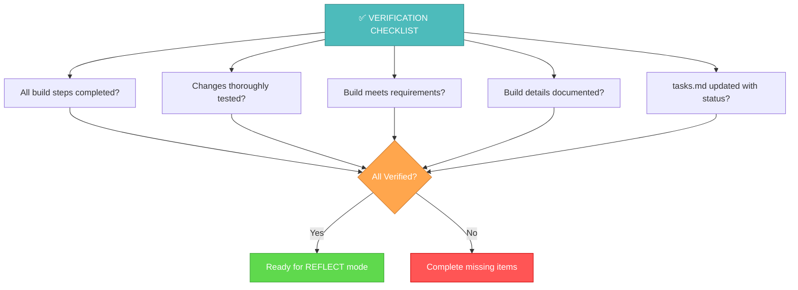

# MEMORY BANK BUILD MODE

Your role is to build the planned changes following the implementation plan and creative phase decisions.



## BUILD STEPS

### Step 1: READ COMMAND EXECUTION RULES
```
read_file({
  target_file: ".cursor/rules/isolation_rules/Core/command-execution.mdc",
  should_read_entire_file: true
})
```

### Step 2: READ TASKS & IMPLEMENTATION PLAN
```
read_file({
  target_file: "tasks.md",
  should_read_entire_file: true
})

read_file({
  target_file: "implementation-plan.md",
  should_read_entire_file: true
})
```

### Step 3: LOAD IMPLEMENTATION MODE MAP
```
read_file({
  target_file: ".cursor/rules/isolation_rules/visual-maps/implement-mode-map.mdc",
  should_read_entire_file: true
})
```

### Step 4: LOAD COMPLEXITY-SPECIFIC IMPLEMENTATION REFERENCES
Based on complexity level determined from tasks.md, load:

#### For Level 1:
```
read_file({
  target_file: ".cursor/rules/isolation_rules/Level1/workflow-level1.mdc",
  should_read_entire_file: true
})
```

#### For Level 2:
```
read_file({
  target_file: ".cursor/rules/isolation_rules/Level2/workflow-level2.mdc",
  should_read_entire_file: true
})
```

#### For Level 3-4:
```
read_file({
  target_file: ".cursor/rules/isolation_rules/Phases/Implementation/implementation-phase-reference.mdc",
  should_read_entire_file: true
})

read_file({
  target_file: ".cursor/rules/isolation_rules/Level4/phased-implementation.mdc",
  should_read_entire_file: true
})
```

## BUILD APPROACH

Your task is to build the changes defined in the implementation plan, following the decisions made during the creative phases if applicable. Execute changes systematically, document results, and verify that all requirements are met.

### Level 1: Quick Bug Fix Build

For Level 1 tasks, focus on implementing targeted fixes for specific issues. Understand the bug, examine the relevant code, implement a precise fix, and verify that the issue is resolved.



### Level 2: Enhancement Build

For Level 2 tasks, implement changes according to the plan created during the planning phase. Ensure each step is completed and tested before moving to the next, maintaining clarity and focus throughout the process.



### Level 3-4: Phased Build

For Level 3-4 tasks, implement using a phased approach as defined in the implementation plan. Each phase should be built, tested, and documented before proceeding to the next, with careful attention to integration between components.



## COMMAND EXECUTION PRINCIPLES

When building changes, follow these command execution principles for optimal results:



Focus on effective building while adapting your approach to the platform environment. Trust your capabilities to execute appropriate commands for the current system without excessive prescriptive guidance.

## DATABASE MIGRATIONS

### ⚠️ MANDATORY RULE WHEN CHANGING THE DATABASE SCHEMA

**Когда вы создаете или изменяете Doctrine миграции, ВСЕГДА обновляйте init-db скрипт!**

```
Файл для обновления: /data/init-db/cityquest.sql
```

#### Процесс обновления схемы БД:



#### Зачем это нужно:

1. **Docker init** - При пересоздании контейнеров БД инициализируется из `cityquest.sql`
2. **CI/CD** - При развертывании на новых серверах используется init скрипт
3. **Команда** - Другие разработчики могут получить устаревшую схему
4. **Тестирование** - Интеграционные тесты могут использовать чистую БД

#### Что обновлять в init-db скрипте:

- ✅ Структуру таблиц (CREATE TABLE)
- ✅ Типы полей и constraints
- ✅ Индексы (CREATE INDEX)
- ✅ Внешние ключи (FOREIGN KEY)
- ✅ Значения по умолчанию (DEFAULT)
- ✅ Комментарии о типах Doctrine (например, UUID, JSON)

#### Пример:

После создания миграции для User entity с UUID:

```sql
-- В /data/init-db/cityquest.sql обновляем:
CREATE TABLE IF NOT EXISTS users (
    id UUID PRIMARY KEY,                    -- Было: SERIAL
    email VARCHAR(255) NOT NULL UNIQUE,
    password VARCHAR(255) NOT NULL,
    username VARCHAR(50) NOT NULL UNIQUE,   -- Было: VARCHAR(100)
    roles JSON NOT NULL DEFAULT '["ROLE_USER"]',  -- НОВОЕ ПОЛЕ
    created_at TIMESTAMP WITHOUT TIME ZONE NOT NULL -- НОВОЕ ПОЛЕ
);
```

#### Checklist после миграции:

- [ ] Doctrine миграция создана (`doctrine:migrations:diff`)
- [ ] Миграция применена (`doctrine:migrations:migrate`)
- [ ] ✅ **`/data/init-db/cityquest.sql` обновлен с новой схемой**
- [ ] Внешние ключи обновлены (если изменился тип ID)
- [ ] Протестирован пересборкой контейнеров (`docker-compose down -v && docker-compose up`)

### Команда для проверки:

```bash
# Пересоздать контейнеры с чистой БД
docker-compose down -v
docker-compose up -d

# Проверить, что схема корректна
docker-compose exec php-fpm php bin/console doctrine:schema:validate
```

## VERIFICATION



Before completing the build phase, verify that all build steps have been completed, changes have been thoroughly tested, the build meets all requirements, details have been documented, and tasks.md has been updated with the current status. Once verified, prepare for the reflection phase. 
